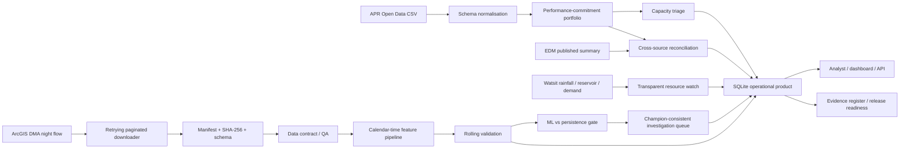

# Architecture — v0.4

## Cloud production design

A production implementation could use:

- Azure Data Lake Storage for immutable raw and validated zones;
- Databricks jobs and Delta tables for ingestion, validation and features;
- MLflow for run tracking and champion/challenger registration;
- Azure Monitor or equivalent for pipeline and data checks;
- Power BI or a small API for operational queues and review tables.

This is a design mapping only. The current repository does not claim an executed Azure or Databricks deployment.

## Data-product contracts

The system exposes separate SQL outputs for three decision types rather than forcing unrelated data into one model:

1. regulatory workstream priority;
2. source reconciliation review;
3. resource context;
4. DMA investigation queue after a live ArcGIS run.

This separation reduces the risk of treating correlated public signals as if they were verified asset-level causal features.
